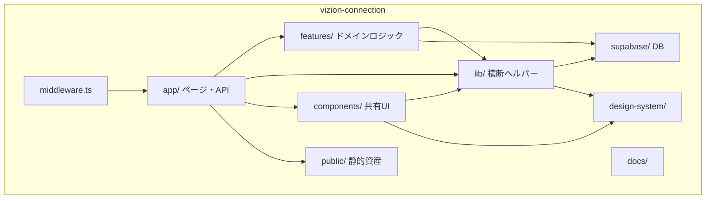
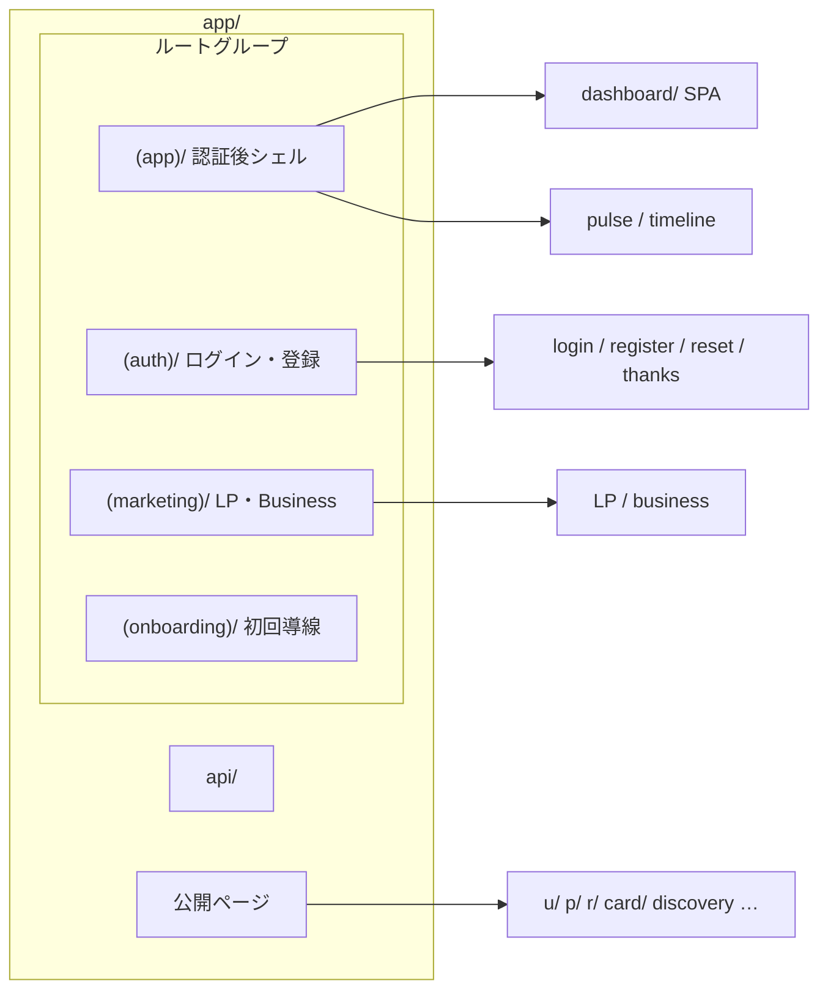
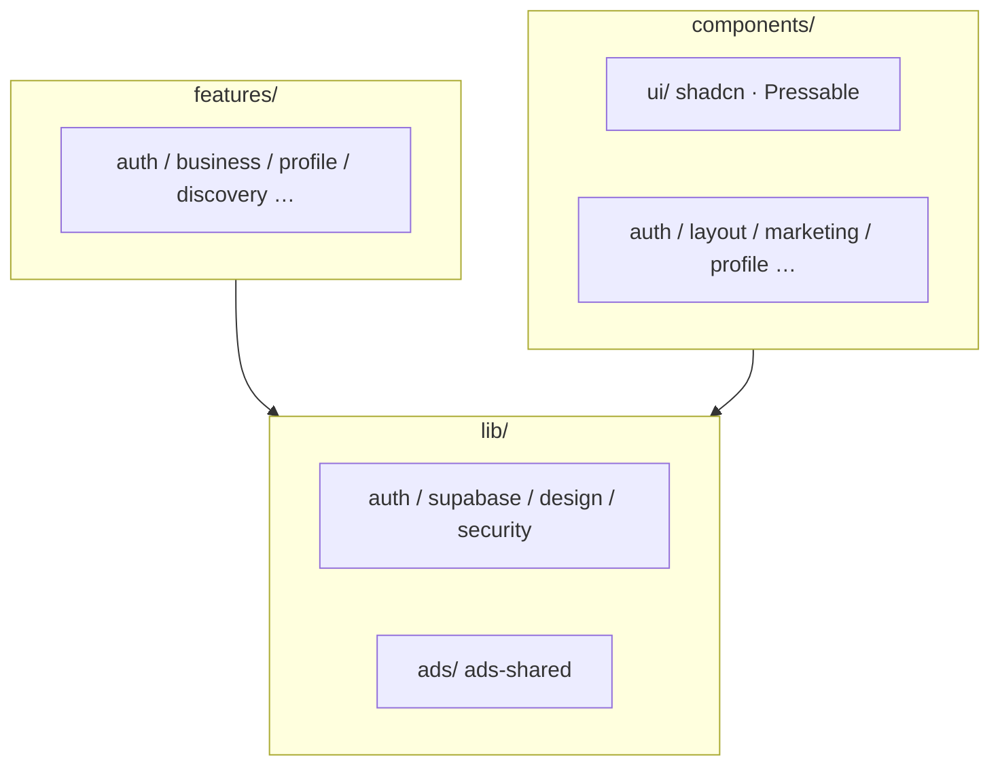
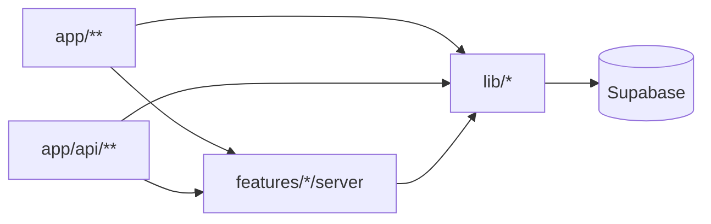

# Vizion Connection — ディレクトリ構成図

**プロジェクト**: vizion-connection（vizion-connection.jp）  
**スタック**: Next.js 16 App Router / React 19 / TypeScript / Tailwind v4 / Supabase  
**ドメイン**: スポーツ向け SaaS（Athlete / Trainer / Crew / Business / Admin）  
**更新**: 2026-07-22（クリーンアップ反映: airtable 削除・src 廃止・lib/ads 集約）

関連: [`usage-inventory.md`](./usage-inventory.md) · [`archive/`](./archive/)

---

## 1. 全体像（レイヤー）



---

## 2. 現行ルート構成（単一 Next アプリ）

```
vizion-connection/
├── app/                    # Next.js App Router
├── components/             # 共有 UI（ui/ は shadcn、domain 寄りのサブdir あり）
├── features/               # ドメイン（server / types / validation）
├── lib/
│   ├── ads/                # 広告取得・スロット注入（旧 src/ を統合）
│   ├── ads-shared.ts       # AdItem 型など
│   ├── auth/ design/ motion/ security/ supabase/ …
│   └── …
├── supabase/               # migrations / seed
├── public/                 # images, fonts, lottie
├── hooks/
├── types/
├── design-system/          # MASTER.md
├── docs/
│   ├── project-structure.md
│   ├── usage-inventory.md
│   ├── design-zones.md
│   ├── archive/            # 旧監査レポート
│   └── legacy-migrations/
├── scripts/
├── email-worker/           # 別パッケージ（任意デプロイ）
├── tools/                  # ローカルツール（lottie-player 等）
├── agent-memory/
├── middleware.ts
├── package.json / next.config.ts / tsconfig.json
└── CLAUDE.md / SECURITY.md / README.md
```

| パス | 役割 |
|---|---|
| `app/` | ルーティング・UI 入口・Route Handler |
| `features/` | ビジネスロジック・Zod・プラン定数 |
| `lib/` | 認証・DB クライアント・トークン・広告・レート制限 |
| `lib/ads/` | `getAdsForUser` / `adSlots` / `adSlotUtils` |
| `components/` | 再利用 UI |
| `supabase/` | SQL マイグレーションのみ追加 |
| `docs/archive/` | 旧監査・移行レポート |

**削除済み（2026-07-22）**: `src/` 全体、`airtable` 依存、未使用 `lib/supabase/client.ts` / `lib/db/*` / `components/ShinyText.tsx` / ルート `components/ui.tsx`、空 API スタブフォルダ。

---

## 3. `app/` 詳細



```
app/
├── (app)/ dashboard | pulse | timeline | business/complete | news-rooms
├── (auth)/ login | register | reset-password | thanks
├── (marketing)/ page | business | roadmap
├── (onboarding)/ onboarding/*
├── api/   # 実装のある route.ts のみ（空スタブ削除済み）
├── auth/confirm/
├── u/[slug]/ p/ r/ card/
├── discovery/ ranking/ schedule/ news/ voicelab/ company/ contact/
├── globals.css
└── layout.tsx
```

### API（主要群）

- 認証: `login` / `logout` / `register` / `auth/confirm/complete` / `account/*`
- プロフィール: `profile/*` / `career-profile` / `bond` / `cheer` / `collect`
- 記録: `journey/*` / `daily-log` / `daily-circuit` / `pulse` / `missions`（`/api/missions` + progress）
- ビジネス: `business-checkout` / `business-hub/*` / `webhooks/square` / `sponsorships`
- Hub: `athlete-hub/stats` / `member-hub/*` / `trainer-hub/*` / `offers/received`
- その他: `ads` / `discovery` / `schedules` / `news` / `voicelab` / `notifications` / `og` / `share`

---

## 4. `lib/ads/` 構成

```
lib/ads/
├── index.ts        # export getAdsForUser, AD_CONFIG, injectAdsIntoFeed, …
├── get-ads.ts      # DB から広告取得（旧 lib/ads.ts）
├── adSlots.ts      # 枠・ティア設定（旧 src/constants/adSlots）
└── adSlotUtils.ts  # フィード注入（旧 src/utils/adSlotUtils）
```

| import | 用途 |
|---|---|
| `@/lib/ads` | `getAdsForUser` 等（既存互換） |
| `@/lib/ads/adSlots` | 型・AD_CONFIG |
| `@/lib/ads/adSlotUtils` | `injectAdsIntoFeed` / `isAdSlot` |
| `@/lib/ads-shared` | `AdItem` 型・`isLocalPlan` |

---

## 5. `features/` · `components/` · `lib/`（要約）



---

## 6. 依存の流れ



| 層 | 置くもの |
|---|---|
| `app/` | ルーティング・UI 入口・Route Handler |
| `features/` | ビジネスロジック・Zod・プラン定数 |
| `lib/` | 横断インフラ（**ads は lib/ads に集約**） |
| `components/` | 再利用 UI |
| `supabase/migrations/` | スキーマ変更のみ |

---

## 7. 将来構成（提案・未適用）

Monorepo 化は**現時点では行っていない**。段階案:

```
# 理想（Turbo monorepo）— 未導入
vizion-connection/
├── apps/web/
├── packages/ui | map | core | types
├── supabase/
└── turbo.json
```

### 短期（単一リポジトリのまま）

| 案 | 状態 |
|---|---|
| `src/` 完全削除 | ✅ 済 |
| 広告を `lib/ads/` に集約 | ✅ 済 |
| 未使用パッケージ・空 API 削除 | ✅ 済 |
| `features/` → `lib/features` 集約 | 未実施（破壊的・任意） |
| `components/` を `ui` / `domain` 分割 | 未実施（任意） |
| apps/packages monorepo | 未実施 |

---

## 8. 関連ドキュメント

- `docs/usage-inventory.md` — 利用実態・未使用候補  
- `docs/archive/MIGRATION_ANALYSIS_REPORT.md` — Airtable→Supabase 移行メモ  
- `docs/archive/PROJECT_AUDIT_REPORT.md` — 過去監査  
- `design-system/MASTER.md` — デザイン正本  
- `lib/design/tokens.ts` — INTERACTION レシピ  
- `CLAUDE.md` / `SECURITY.md`  
